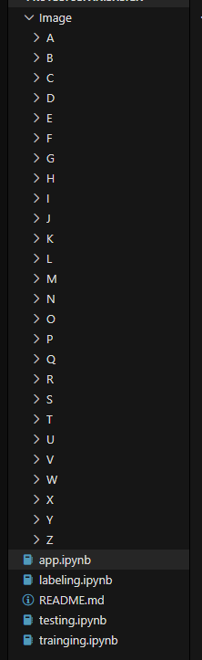
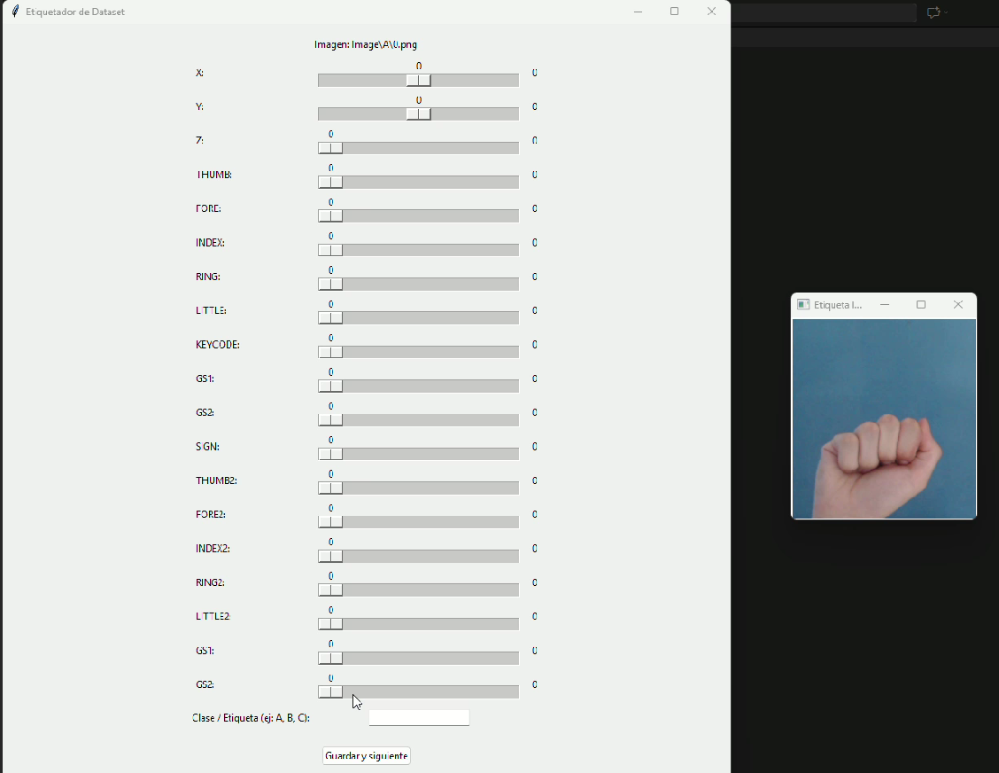

# Pasos

1. Descargar el dataset, y meterlo en una carpeta con el cuaderno de python

2. cargar y etiquetar los datos, manualmente el informe dice tener estos datos

Attribute Description Relevant
 x Positiononxaxis *
 y Positiononyaxis *
 z Positiononzaxis *

 roll Palmrotation *  

 pitch Nodescription
 yaw Nodescription  

 thumb Thumbfingerposition *
 fore Forefingerposition *
 index Indexfingerposition *
 ring Ringfingerposition *
 little Littlefingerposition
 keycode Keyontheglobepressed 

 gs1 Firststateoftheglove  //booleanos de si se usan o no las manos, First izquierda, 
 gs2 Secondstateoftheglove // Second derecha

 Sign Signal read  // valor del guante existe o no existe 

SE ME OLVIDÓ PERO B, TIENE ROTACIÓN X 90 ROTACIÓN Z 180

## Para la el etiquetado de datos

